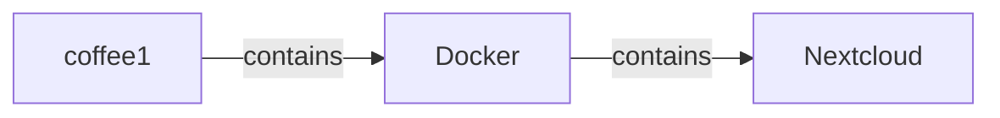

# CTRoadmap Build Specification

## Project Purpose

**CTRoadmap** is a local-first infrastructure mapping web app for visually documenting a personal/home server stack.

The app should let a user create tiles, subtiles, and relationship lines in a GUI, while the backend quietly maintains structured data that can later be exported to Markdown, YAML, and Mermaid diagrams.

This is **not** primarily a monitoring dashboard. It is a living infrastructure atlas.

The core question CTRoadmap should answer is:

> What exists, where does it live, what does it depend on, and how does it work?

For the CTDC use case, this means mapping physical nodes, services, drives, mounted paths, scripts, config files, SSH keys, admin URLs, custom functions, and feature flows.

Example:

```text
Coffee1 Node
├── Docker
│   └── Nextcloud
├── Drives
│   ├── Boot NVMe
│   ├── Nextcloud Data Drive
│   └── Backup SSD
└── Wake / Sleep Function
    ├── dispatch1 dashboard button
    ├── SSH key
    ├── coffee1 safe-suspend wrapper
    └── systemd service
```

The user should enter this information through the GUI, not by hand-authoring YAML or Markdown first.

---

# Core Design Principles

## 1. GUI-first, structured-data backend

The user creates and edits the map visually.

The backend stores the source of truth as structured JSON.

Exports are generated from that JSON.

```text
GUI edits atlas.json
atlas.json exports Markdown / YAML / Mermaid
```

Do **not** make Markdown the canonical data source.

## 2. Local-first

The app should run locally on a trusted machine or LAN.

Initial deployment target:

```text
Docker Compose
```

Development target:

```text
Bare-metal dev mode using Node + Python
```

## 3. Purpose-built, not generic diagramming

CTRoadmap is not meant to become a Lucidchart clone.

Every tile should have meaning:

- Node
- Service
- Container
- Drive
- Mount
- Script
- Config
- Secret Reference
- Function / Flow
- URL
- Check

Every line should also have meaning:

- contains
- runs
- calls
- controls
- depends_on
- uses_storage
- mounted_at
- backs_up_to
- requires_key
- requires_config
- exposes_url
- validates_with
- fails_if

## 4. Human-readable, AI-readable, and backup-friendly

The stored data should remain easy to inspect and back up.

Initial storage should be simple:

```text
data/atlas.json
exports/
```

Do not begin with a complex database unless absolutely necessary.

SQLite can be considered later, but JSON is preferred for the MVP.

---

# Recommended Stack

## Frontend

```text
React
React Flow
TypeScript preferred
Vite preferred
```

The frontend should provide:

- draggable tiles
- parent/subtile grouping
- relationship lines
- editable tile fields
- editable relationship labels
- filtering by tile type
- search
- export buttons
- ability to copy commands from tiles that are 'command' objects

## Backend

```text
Python
FastAPI
Pydantic
```

The backend should provide:

- load atlas JSON
- save atlas JSON
- validate atlas schema
- export Markdown
- export YAML
- export Mermaid
- basic health endpoint

## Deployment

```text
Docker Compose
```

Suggested service layout:

```text
ctroadmap/
├── backend/
├── frontend/
├── data/
├── exports/
├── docker-compose.yml
└── README.md
```

For production/local LAN use, the frontend may either:

1. be served separately by a frontend container, or
2. be built and served by the FastAPI backend as static files.

For simplicity, option 2 is preferred after frontend build.

---

# Core Data Model

The initial canonical file should be:

```text
data/atlas.json
```

Minimum structure:

```json
{
  "version": "0.1",
  "metadata": {
    "name": "CTRoadmap",
    "description": "Local infrastructure atlas",
    "updated_at": null
  },
  "tiles": [],
  "links": [],
  "views": []
}
```

---

## Tile Object

Each visual tile/card should follow this shape:

```json
{
  "id": "unique_tile_id",
  "type": "node",
  "title": "coffee1",
  "parent": null,
  "position": {
    "x": 100,
    "y": 200
  },
  "size": {
    "width": 220,
    "height": 120
  },
  "fields": {
    "role": "Main server",
    "hostname": "coffee1",
    "ip": "",
    "os": "Ubuntu Server",
    "purpose": "Hosts Nextcloud, Docker, Samba, and future Immich"
  },
  "notes": "",
  "tags": ["ctdc", "server"]
}
```

Required fields:

```text
id
type
title
position
fields
```

Optional fields:

```text
parent
size
notes
tags
```

---

## Supported Tile Types

Initial tile types:

```text
node
service
container
drive
mount
script
config
secret_ref
flow
url
check
note
```

### Tile Type Meanings

| Type       | Purpose                             | Example                    |
| ---------- | ----------------------------------- | -------------------------- |
| node       | physical or logical machine         | coffee1, table2, dispatch1 |
| service    | app, daemon, or system service      | Docker, Samba, Ollama      |
| container  | Docker container or compose service | Nextcloud AIO, MariaDB     |
| drive      | physical or logical storage device  | Boot NVMe, Backup SSD      |
| mount      | filesystem mount path               | /mnt/nextcloud-data        |
| script     | custom executable logic             | coffee1-sleep.sh           |
| config     | important config file               | sudoers rule, fstab entry  |
| secret_ref | reference to key/token only         | SSH key reference          |
| flow       | user-facing function or process     | Wake coffee1               |
| url        | admin or service URL                | Nextcloud login page       |
| check      | validation/test command             | ping coffee1               |
| note       | general documentation note          | maintenance reminder       |

Important: `secret_ref` must never store secret values. It may store paths, names, purpose, rotation notes, and permissions.

---

## Link Object

Each relationship line should follow this shape:

```json
{
  "id": "unique_link_id",
  "from": "source_tile_id",
  "to": "target_tile_id",
  "type": "depends_on",
  "label": "depends on",
  "notes": "",
  "directional": true
}
```

Required fields:

```text
id
from
to
type
```

Optional fields:

```text
label
notes
directional
```

---

## Supported Relationship Types

Initial relationship types:

```text
contains
runs
hosts
calls
controls
depends_on
uses_storage
mounted_at
backs_up_to
requires_key
requires_config
exposes_url
validates_with
fails_if
documents
related_to
```

### Relationship Type Meanings

| Type            | Meaning                                             |
| --------------- | --------------------------------------------------- |
| contains        | parent object contains child object                 |
| runs            | node runs service                                   |
| hosts           | node/service hosts another thing                    |
| calls           | one script/service calls another                    |
| controls        | one node/service controls another                   |
| depends_on      | general dependency                                  |
| uses_storage    | service uses a drive or mount                       |
| mounted_at      | drive is mounted at a path                          |
| backs_up_to     | source backs up to target                           |
| requires_key    | action requires a key/token/credential reference    |
| requires_config | action requires a config file                       |
| exposes_url     | service exposes a web/admin URL                     |
| validates_with  | object can be checked by a validation tile          |
| fails_if        | object/function fails if target condition is broken |
| documents       | note/doc tile documents target                      |
| related_to      | generic relationship fallback                       |

---

## View Object

Views are saved layouts or filters over the same atlas data.

```json
{
  "id": "physical_view",
  "title": "Physical Topology",
  "description": "Hardware, switch, cabling, and nodes",
  "visible_types": ["node", "drive", "mount"],
  "visible_links": ["contains", "mounted_at", "runs"],
  "camera": {
    "x": 0,
    "y": 0,
    "zoom": 1
  }
}
```

Initial default views:

```text
Physical
Services
Storage
Security
Flows
Everything
```

---

# GUI Requirements

## Main UI Areas

The GUI should have four major areas:

```text
Top toolbar
Left tile palette / filters
Main canvas
Right inspector panel
```
Style:
  Should be dark, modern, techy. Canvas with faint grid background. Tiles translucent with neon glow edging. Color coding to differentiate tile types, relationship types & such. Varied line types for connecitons to denote different types of connections. Tile shapes to differentiate Hardware vs software vs location vs function/feature, etc. 

## Top Toolbar

Required controls:

```text
New Tile
New View
Save
Export Markdown
Export YAML
Export Mermaid
Search
View (Plan to have multiple chart style options SEE: gui inspiration .png files)
Settings
   |- Color pallet chooser 
```

Optional controls:

```text
Undo
Redo
Auto-layout
Import JSON
Download atlas.json
```

## Left Panel

The left panel should contain:

- tile type palette
- filters by tile type
- filters by relationship type
- saved views
- search results

## Main Canvas

The canvas should support:

- drag tiles
- connect tiles with lines
- select tile
- select line
- zoom
- pan
- collapse/expand child tiles if feasible
- show parent/child grouping if feasible

## Right Inspector Panel

When a tile is selected, show editable fields:

```text
Title
Type
Parent
Tags
Notes
Type-specific fields
```

When a relationship is selected, show editable fields:

```text
From
To
Type
Label
Notes
Directional true/false
```

## Tile Creation

The user should be able to:

1. click `New Tile`
2. choose tile type
3. enter title
4. optionally select parent
5. tile appears on canvas
6. tile is saved to JSON

## Subtile Creation

The user should be able to create a subtile from an existing tile.

Example:

```text
Right-click Coffee1
→ Add Subtile
→ Type: Service
→ Title: Docker
```

This should create:

```text
Docker tile
parent = coffee1 tile ID
contains relationship from coffee1 to Docker
```

## Relationship Creation

The user should be able to draw a line between two tiles and choose relationship type.

Example:

```text
dispatch1 dashboard → coffee1 safe suspend
Relationship: controls
Label: sleep button triggers safe suspend
```

---

# Export Requirements

## Markdown Export

The Markdown export should generate a human-readable atlas.

Suggested output file:

```text
exports/CTRoadmap-Atlas.md
```

The generated Markdown should include:

```text
# CTRoadmap Atlas

## Nodes
## Services
## Storage
## Scripts
## Config Files
## Secret References
## Flows
## URLs
## Checks
## Relationships
```

Each tile should become a section or bullet.

Each relationship should be listed in readable language.

Example:

```markdown
## coffee1

Type: node

### Fields

- role: Main server
- os: Ubuntu Server

### Children

- Docker
- Nextcloud Data Drive

### Relationships

- coffee1 runs Docker
- coffee1 hosts Nextcloud
```

## YAML Export

Suggested output file:

```text
exports/atlas.yaml
```

The YAML export should preserve the tile/link model in a cleaner YAML format.

## Mermaid Export

Suggested output file:

```text
exports/atlas.mmd
```

Generate a Mermaid flowchart using tile titles and relationship labels.

Example:



A later version can generate separate diagrams by view.

---

# API Requirements

Suggested FastAPI endpoints:

```text
GET  /api/health
GET  /api/atlas
PUT  /api/atlas
POST /api/export/markdown
POST /api/export/yaml
POST /api/export/mermaid
GET  /api/export/markdown/download
GET  /api/export/yaml/download
GET  /api/export/mermaid/download
```

Optional endpoints:

```text
POST /api/tiles
PATCH /api/tiles/{tile_id}
DELETE /api/tiles/{tile_id}

POST /api/links
PATCH /api/links/{link_id}
DELETE /api/links/{link_id}
```

For the MVP, it is acceptable for the frontend to edit the whole atlas object and save it using `PUT /api/atlas`.

---

# Security Requirements

This is a local/LAN app, but still follow these rules:

## Never store raw secrets

Do not store:

- private SSH key contents
- passwords
- API keys
- app passwords
- recovery codes
- tokens

Allowed secret reference data:

```text
name
purpose
host
path
allowed command
rotation notes
permission notes
```

Example:

```json
{
  "id": "secret_dispatch1_coffee1_sleep_key",
  "type": "secret_ref",
  "title": "dispatch1 → coffee1 sleep SSH key",
  "fields": {
    "host": "dispatch1",
    "path": "$HOME/.ssh/ctdc_coffee1_sleep",
    "purpose": "Allows dispatch1 to trigger coffee1 safe sleep command",
    "allowed_command": "/usr/local/sbin/ctdc-safe-suspend",
    "stores_secret_value": false
  }
}
```

## No command execution in MVP

The MVP should not execute shell commands, SSH commands, Docker commands, or validation checks.

Validation/check tiles should be documentation only in Phase 1.

Live validation can be added later.

## Local access assumption

Initial version may run without login if bound to localhost or trusted LAN only.

If exposing beyond localhost/LAN, authentication is required.

---

# Docker Requirements

Provide a `docker-compose.yml`.

Suggested service:

```yaml
services:
  ctroadmap:
    build: .
    container_name: ctroadmap
    ports:
      - "8088:8088"
    volumes:
      - ./data:/app/data
      - ./exports:/app/exports
    restart: unless-stopped
```

The app should listen on:

```text
0.0.0.0:8088
```

Default local URL:

```text
http://localhost:8088
```

---

# Phase 1 — MVP Atlas Editor

## Goal

Build the minimum useful CTRoadmap app:

> A local web app where the user can create tiles, create subtiles, draw relationships, edit details, and save/load the atlas from JSON.

## Deliverables

### Backend

- FastAPI app
- `GET /api/health`
- `GET /api/atlas`
- `PUT /api/atlas`
- Pydantic models for atlas, tiles, links, views
- creates `data/atlas.json` if missing
- validates atlas on save
- simple error handling

### Frontend

- React app
- React Flow canvas
- tile rendering by type
- create/edit/delete tile
- create subtile
- create/edit/delete relationship
- right-side inspector panel
- save button
- load existing atlas on startup
- basic search/filter

### Storage

- canonical save file:

```text
data/atlas.json
```

### Deployment

- Dockerfile
- docker-compose.yml
- README with run instructions

## Phase 1 Acceptance Criteria

The user can:

1. start the app with Docker Compose
2. open the app in a browser
3. create a `coffee1` node tile
4. create a `Docker` subtile under `coffee1`
5. create a `Nextcloud` subtile under `Docker`
6. draw a relationship between two tiles
7. edit tile details in the inspector
8. save the atlas
9. restart the app
10. see the saved atlas reload correctly

## Phase 1 Non-Goals

Do not build:

- live monitoring
- SSH execution
- Docker API integration
- user accounts
- database
- advanced auto-layout
- multi-user collaboration

---

# Phase 2 — Exports, Views, and Usability

## Goal

Make the atlas useful outside the GUI.

> The app should generate readable documentation and diagrams from the visual map.

## Deliverables

### Export System

Implement exports:

```text
Markdown
YAML
Mermaid
```

Required endpoints:

```text
POST /api/export/markdown
POST /api/export/yaml
POST /api/export/mermaid
GET /api/export/markdown/download
GET /api/export/yaml/download
GET /api/export/mermaid/download
```

Export files:

```text
exports/CTRoadmap-Atlas.md
exports/atlas.yaml
exports/atlas.mmd
```

### Views

Implement saved views:

```text
Physical
Services
Storage
Security
Flows
Everything
```

A view should control visible tile types and relationship types.

### UI Improvements

Add:

- type icons or color classes
- relationship labels on canvas
- better search
- duplicate tile
- auto-generated IDs
- import/export `atlas.json`
- basic keyboard shortcuts
- warnings for broken links
- warnings for missing required fields

## Phase 2 Acceptance Criteria

The user can:

1. build a small map in the GUI
2. export Markdown
3. export YAML
4. export Mermaid
5. download the exported files
6. switch between saved views
7. filter the canvas by tile type
8. detect if a relationship points to a missing tile
9. re-import an exported/saved `atlas.json`

## Phase 2 Non-Goals

Do not build:

- live system checks
- command execution
- automatic scanning
- authentication unless needed for deployment
- complex database migration

---

# Phase 3 — Flow Builder and Validation Planning

## Goal

Add the feature that makes CTRoadmap more than a diagram tool:

> The user should be able to document complete operational flows and define non-executing validation checks.

Example flow:

```text
User clicks Sleep button
→ dispatch1 dashboard route receives request
→ dispatch1 runs SSH command
→ coffee1 restricted key allows safe command
→ coffee1 sudo wrapper starts systemd unit
→ coffee1 suspends
```

## Deliverables

### Flow Builder

A `flow` tile should support ordered steps.

Suggested flow tile structure:

```json
{
  "id": "flow_sleep_coffee1",
  "type": "flow",
  "title": "Sleep coffee1 from dispatch1 dashboard",
  "fields": {
    "trigger": "User clicks Sleep button",
    "purpose": "Safely suspend coffee1 from dispatch1",
    "steps": [
      {
        "order": 1,
        "from": "user",
        "to": "dispatch1_dashboard",
        "action": "Clicks Sleep button"
      },
      {
        "order": 2,
        "from": "dispatch1_dashboard",
        "to": "coffee1_safe_suspend_script",
        "action": "Calls SSH command"
      }
    ]
  }
}
```

### Check Tiles

Add `check` tile support.

Check tiles should document how something would be validated but should not execute commands yet.

Example:

```json
{
  "id": "check_coffee1_ping",
  "type": "check",
  "title": "Check coffee1 reachable",
  "fields": {
    "command": "ping coffee1",
    "expected_result": "coffee1 responds",
    "execution_enabled": false
  }
}
```

### Failure Points

Support `fails_if` relationships.

Example:

```text
Sleep coffee1 flow fails_if SSH key permissions are wrong
```

### Flow Export

Markdown export should include a special section for flows:

```markdown
## Flow: Sleep coffee1 from dispatch1 dashboard

### Trigger
User clicks Sleep button.

### Steps
1. User clicks Sleep button.
2. dispatch1 dashboard calls SSH command.
3. coffee1 safe suspend wrapper starts systemd unit.

### Dependencies
- SSH key
- sudoers rule
- systemd service

### Failure Points
- coffee1 unreachable
- SSH key permission wrong
- sudoers rule missing
```

### HERMES-Readable Export Planning

Add a future-facing YAML export section suitable for HERMES/agent use.

This should remain non-executing in Phase 3.

## Phase 3 Acceptance Criteria

The user can:

1. create a flow tile
2. add ordered flow steps
3. connect flow steps to existing tiles
4. add check tiles
5. link check tiles with `validates_with`
6. add failure relationships with `fails_if`
7. export a Markdown flow explanation
8. export YAML that preserves flow steps and check definitions
9. confirm no commands are executed by the app

## Phase 3 Non-Goals

Do not build:

- real SSH execution
- automatic validation
- background agents
- HERMES automation
- credential storage
- public internet exposure

---

# Suggested Initial CTDC Seed Data

The app may optionally include a small seed example for CTDC.

Do not hardcode this as required data.

Suggested seed tiles:

```text
server1
server2
server3
switch1
Docker
Nextcloud
Samba
Ollama / Qwen 2.5 7B
dispatch1 dashboard
Wake server1
Sleep server1
```

Suggested seed relationships:

```text
server1 runs Docker
server1 hosts Nextcloud
server1 hosts Samba
server2 runs Qwen 2.5 7B
server3 hosts dashboard
server3 controls coffee1 sleep/wake
switch1 connects coffee1
switch1 connects table2
switch1 connects dispatch1
```

---

# Suggested README Commands

The README should include:

## Start with Docker

```bash
docker compose up -d
```

Open:

```text
http://localhost:8088
```

## Stop

```bash
docker compose down
```

## View logs

```bash
docker compose logs -f
```

## Backup data

```bash
cp data/atlas.json data/atlas.backup.json
```

---

# Final Build Direction

Build CTRoadmap as:

```text
A Dockerized local web app
with React Flow frontend
FastAPI backend
JSON source of truth
Markdown/YAML/Mermaid export
and no command execution in the MVP
```

The first usable version should prioritize:

```text
tiles
subtiles
relationships
saving/loading
simple exports
```

Avoid drifting into monitoring, scanning, command execution, or user management until the atlas editor itself is solid.

#NOTE: You are running in a WSL shell, so use the Linux Node/npm installed inside WSL, not Windows Node. First check `which node`, `node --version`, `which npm`, and `npm --version`. If unavailable, stop and tell me. Do not assume Windows Node is available inside WSL.