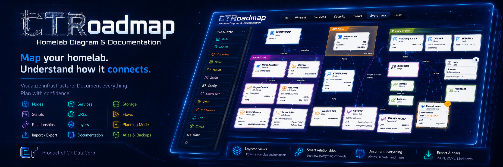

# CTRoadmap


CTRoadmap is a local-first infrastructure atlas for documenting nodes, services, storage, scripts, configs, URLs, and operational relationships. It is a Docker-served beta application backed by the human-readable `data/atlas.json` file.

CTRoadmap is documentation-only software. It does not execute commands, open SSH sessions, issue Docker calls, or run live checks against your infrastructure.

## Beta Docker Install

The recommended beta release path is the published Docker image:

```text
ghcr.io/noobcity99/ctroadmap:beta
```

Beta users do not need to clone this repository or install Python, Node, or npm.

Requirements:

- Linux server
- Docker
- Docker Compose v2
- curl
- Port 8088 reachable if accessing CTRoadmap from another machine

Option A, safer:

```bash
curl -fsSL https://raw.githubusercontent.com/NoobCity99/CTRoadmap/main/CTR_install.sh -o CTR_install.sh
chmod +x CTR_install.sh
./CTR_install.sh
```

Option B, one-liner:

```bash
curl -fsSL https://raw.githubusercontent.com/NoobCity99/CTRoadmap/main/CTR_install.sh | bash
```

Custom install directory:

```bash
CTR_INSTALL_DIR=/opt/ctroadmap-beta ./CTR_install.sh
```

Management commands:

```bash
cd ~/ctroadmap-beta
docker compose logs -f
docker compose down
docker compose up -d
docker compose pull && docker compose up -d
```

Manual beta update:

```bash
cd ~/ctroadmap-beta && docker compose pull && docker compose up -d
```

Uninstall:

```bash
curl -fsSL https://raw.githubusercontent.com/NoobCity99/CTRoadmap/main/CTR_uninstall.sh -o CTR_uninstall.sh
chmod +x CTR_uninstall.sh
./CTR_uninstall.sh
```

Persistent data lives in:

```text
~/ctroadmap-beta/data
~/ctroadmap-beta/exports
```

## Run With Docker

```bash
docker compose up -d
```

Open:

```text
http://localhost:8088
```

Stop:

```bash
docker compose down
```

Logs:

```bash
docker compose logs -f
```

Update Advisory is informational only. CTRoadmap does not auto-update, run Docker commands, mount the Docker socket, or execute system-management actions.

## Data And Backup

CTRoadmap stores its persistent state in bind-mounted directories so that replacing or updating the container does not replace your atlas.

- `data/atlas.json` is the canonical atlas containing tiles, relationships, families, stacks, and saved Layers.
- `data/assets/icons/` contains icons uploaded through the Icon Library.
- `data/auth.json` contains local passcode configuration and session state when Local Access Passcode is enabled.
- `data/update_state.json` stores update-advisory settings and cached advisory state.
- `exports/` contains generated Markdown, YAML, and Mermaid exports.

Back up the complete persistent state rather than only the atlas file:

```bash
cp -a data data.backup
cp -a exports exports.backup
```

Keep backups outside the installation directory before uninstalling or making destructive host changes.

## Local Access Passcode

Local Access Passcode provides optional authentication for the CTRoadmap web interface. It is disabled until a passcode is configured in Settings.

From Settings, an administrator can create or change the passcode, sign out the current browser, sign out all sessions, or remove passcode protection. This is application-level access control for a local deployment; continue to use appropriate network and host security for any exposed installation.


## Features

### Canvas Editor

- Create, edit, duplicate, delete, drag, search, and filter typed tiles.
- Model nodes, services, containers, drives, mounts, scripts, configs, secret references, flows, IoT devices, URLs, checks, and notes.
- Designate primary nodes and arrange child tiles within their parent nodes.
- Create typed relationships and edit their labels, notes, endpoints, and directionality.
- Choose connector routing that may pass through tiles or avoid them.
- Lock the canvas to prevent accidental changes while navigating.
- Document checks with command and expected-result fields without executing them.

### Handbook

- Browse the atlas as a structured handbook organized around primary nodes, families, and documented relationships.
- Add detailed operational notes and reference information to tiles and relationships.
- Move between handbook entries and the corresponding canvas items.

### Layers

- Create, rename, edit, and delete saved Layers for focused views of the atlas.
- Filter Layers by tile type, lifecycle, family, and relationship visibility.
- Switch between canvas topology, layered hierarchy, and handbook layouts where supported.

Layers are persisted in the atlas schema as `views` for compatibility.

### Planning Mode

- Model planned tiles and relationships before they go live.
- Visually distinguish planned infrastructure from live infrastructure.
- Promote planned items when they become operational.

### Families

- Group related tiles into named, color-coded families.
- Use family regions on the canvas to organize larger systems visually.
- Use family organization in the Handbook and Layer filters.

### Stacks

- Collapse related sibling tiles into compact stacks when they share a parent.
- Stack mount-child relationships to reduce visual clutter.
- Expand, focus, and unstack items without removing their underlying atlas data.

### Import And Export

- Import an atlas JSON file through backend validation and preview before replacing current data.
- Download the current atlas as a local JSON backup.
- Generate Markdown, YAML, and Mermaid exports in `exports/`.
- Download generated exports from the application toolbar.

### Appearance

- Select from Cyber, Aurora, Ember, Blueprint, and NES color palettes.
- Choose Grid, Hex, Tron Dark, Tron Lite, Blueprint, PCB Board, NES Grid, or LT Draft Grid canvas backgrounds.
- Assign built-in or uploaded icons to tiles through the Icon Library.
- Adjust canvas and connector presentation without changing atlas content.

### Settings And Admin

- Check backend health and view the running application version.
- Review informational update advisories and configure update checks.
- Configure Local Access Passcode and manage active sessions.
- Upload, browse, and remove custom icon assets.
- Export frontend and backend debug information or clear the backend debug log.

Flow steps, check commands, and expected results are documentation only. CTRoadmap does not execute them.

## Keyboard Shortcuts

```text
Ctrl/Cmd+S       Save
Ctrl/Cmd+D       Duplicate selected tile
Delete/Backspace Delete selected tile or relationship
/                Focus search
Escape           Clear selection
```
<table>
  <tr>
    <td></td>
    <td></td>
  </tr>
  <tr>
    <td></td>
    <td></td>
  </tr>
</table>


## API

```text
GET  /api/health
GET  /api/app/version
GET  /api/app/update
PUT  /api/app/update/settings

GET  /api/auth/status
POST /api/auth/setup
POST /api/auth/login
POST /api/auth/logout
POST /api/auth/change-passcode
POST /api/auth/remove-passcode
POST /api/auth/logout-all

GET  /api/atlas
PUT  /api/atlas
POST /api/atlas/preview

POST   /api/assets/icons
GET    /api/assets/icons
GET    /api/assets/icons/{filename}
DELETE /api/assets/icons/{filename}

POST /api/export/{format}
GET  /api/export/{format}/download

GET  /api/debug/log
POST /api/debug/log/clear
```

Supported export formats are `markdown`, `yaml`, and `mermaid`.

## Project Log

Planning decisions, questions and answers, bugs, and fixes are tracked in `PROJECT_LOG.md`.

## License

CTRoadmap is licensed under the Apache License 2.0. See [LICENSE](LICENSE).

## Contributors
- NoobCity99