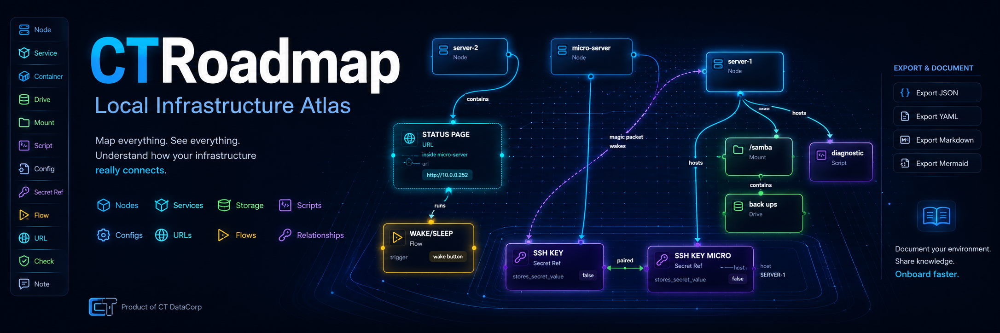

# CTRoadmap


CTRoadmap is a local-first infrastructure atlas for documenting nodes, services, storage, scripts, configs, URLs, checks, and operational relationships.

CTRoadmap is a GUI-first editor backed by `data/atlas.json`. It does not execute commands, SSH, Docker calls, or live checks.

## Beta Docker Install

The recommended beta release path is the published Docker image:

```text
ghcr.io/noobcity99/ctroadmap:beta
```

Beta users do not need to clone this repository or install Python, Node, or npm.

Requirements:

- Linux server
- Docker
- Docker Compose v2
- curl
- Port 8088 reachable if accessing CTRoadmap from another machine

Option A, safer:

```bash
curl -fsSL https://raw.githubusercontent.com/NoobCity99/CTRoadmap/main/CTR_install.sh -o CTR_install.sh
chmod +x CTR_install.sh
./CTR_install.sh
```

Option B, one-liner:

```bash
curl -fsSL https://raw.githubusercontent.com/NoobCity99/CTRoadmap/main/CTR_install.sh | bash
```

Custom install directory:

```bash
CTR_INSTALL_DIR=/opt/ctroadmap-beta ./CTR_install.sh
```

Management commands:

```bash
cd ~/ctroadmap-beta
docker compose logs -f
docker compose down
docker compose up -d
docker compose pull && docker compose up -d
```

Manual beta update:

```bash
cd ~/ctroadmap-beta && docker compose pull && docker compose up -d
```

Uninstall:

```bash
curl -fsSL https://raw.githubusercontent.com/NoobCity99/CTRoadmap/main/CTR_uninstall.sh -o CTR_uninstall.sh
chmod +x CTR_uninstall.sh
./CTR_uninstall.sh
```

Persistent data lives in:

```text
~/ctroadmap-beta/data
~/ctroadmap-beta/exports
```

## Run With Docker

```bash
docker compose up -d
```

Open:

```text
http://localhost:8088
```

Stop:

```bash
docker compose down
```

Logs:

```bash
docker compose logs -f
```

Backup data:

```bash
cp data/atlas.json data/atlas.backup.json
```


Update Advisory is informational only. CTRoadmap does not auto-update, run Docker commands, mount the Docker socket, or execute system-management actions.


## Features

- Create, edit, delete, drag, search, and filter typed tiles.
- Create subtiles from the inspector; this creates a `contains` relationship.
- Draw typed relationships between tiles in the canvas.
- Edit relationship type, label, notes, endpoints, and directionality.
- Duplicate tiles from the inspector or with `Ctrl/Cmd+D`.
- Add ordered flow steps to `flow` tiles from the inspector.
- PLANNING MODE: Plan nodes & connections before going live, visual distinction while planning.
- Document non-executing checks with command and expected-result fields.
- Save and reload the canonical atlas at `data/atlas.json`.
- Create, edit, delete, and switch saved views.
- Switch between `canvas_topology` and `layered_hierarchy` templates per view.
- Import a saved `atlas.json` after backend validation.
- Download the current atlas JSON from the browser.
- Export Markdown, YAML, and Mermaid files to `exports/`.
- Download generated export files from the toolbar.
- LOCK canvas to prevent accidental changes while navigating.
- See warnings for broken links and missing required tile data.
- See warnings for incomplete flows/checks.
- Load optional CTDC sample data from the toolbar.

Flow steps and check tiles are documentation only. CTRoadmap does not run check commands.

## Keyboard Shortcuts

```text
Ctrl/Cmd+S       Save
Ctrl/Cmd+D       Duplicate selected tile
Delete/Backspace Delete selected tile or relationship
/                Focus search
Escape           Clear selection
```
<table>
  <tr>
    <td></td>
    <td></td>
  </tr>
  <tr>
    <td></td>
    <td></td>
  </tr>
</table>


## API

```text
GET  /api/health
GET  /api/app/version
GET  /api/app/update
PUT  /api/app/update/settings
GET  /api/atlas
PUT  /api/atlas
POST /api/export/markdown
POST /api/export/yaml
POST /api/export/mermaid
GET  /api/export/markdown/download
GET  /api/export/yaml/download
GET  /api/export/mermaid/download
```

## Project Log

Planning decisions, questions and answers, bugs, and fixes are tracked in `PROJECT_LOG.md`.

## License

CTRoadmap is licensed under the Apache License 2.0. See [LICENSE](LICENSE).
