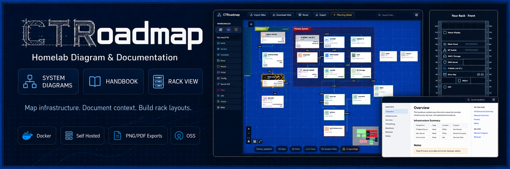

<p align="center">
  <a href="https://github.com/NoobCity99/CTRoadmap/stargazers">
    
  </a>
  <a href="https://github.com/NoobCity99/CTRoadmap/pkgs/container/ctroadmap">
    
  </a>
</p>

<p align="center">
  
  
</p>

CTRoadmap is a self-hosted Diagram & Documentation tool for your **HOMELAB** via nodes, services, storage, scripts, configs, URLs, and operational relationships. Meant to be a step up from PowerPoint or other *diagram* apps, CTR intentionally a NON-INTEGRATED, stand-alone repository of your system. It does not montior, control, or interface with your homelab at all. Just Document.  It is a Docker-served browser webapp that saves your system documentation to the `data/atlas.json` file.


<table>
  <tr>
    <td></td>
    <td></td>
  </tr>
  <tr>
    <td></td>
    <td></td>
  </tr>
</table>

## Beta Docker Install

The recommended beta release path is the published Docker image:

```text
ghcr.io/noobcity99/ctroadmap:beta
```

Beta users do not need to clone this repository or install Python, Node, or npm.

### Standard Linux / Docker install

Requirements:

- Linux server
- Docker
- Docker Compose v2
- `curl`
- Bash, `sha256sum`, standard Linux utilities, and CA certificates
- Port 8088 reachable if accessing CTRoadmap from another machine

Recommended install:

```bash
curl -fsSL https://raw.githubusercontent.com/NoobCity99/CTRoadmap/main/CTR_install.sh -o CTR_install.sh
chmod +x CTR_install.sh
./CTR_install.sh
```

The installer creates the CTRoadmap installation, starts the Docker container, and installs/registers the host-side `ctr_update.sh` updater used by standard Linux installations.

One-liner install:

```bash
curl -fsSL https://raw.githubusercontent.com/NoobCity99/CTRoadmap/main/CTR_install.sh | bash
```

Custom install directory:

```bash
CTR_INSTALL_DIR=/opt/ctroadmap-beta ./CTR_install.sh
```

After installation, open:

```text
http://YOUR-SERVER-IP:8088
```

The default installation directory is:

```text
~/ctroadmap-beta
```

### Synology / NAS / Portainer installs

CTRoadmap can also be deployed through NAS and Portainer-managed Docker environments.

Those platforms have their own install and container-management workflows, so this README does not duplicate platform-specific setup instructions.

For NAS / Portainer installation guidance, see:

**https://mariushosting.com/?s=ctroadmap**

### Common management commands

For the default Linux installation:

```bash
cd ~/ctroadmap-beta
docker compose logs -f
docker compose down
docker compose up -d
./ctr_update.sh
```

If CTRoadmap is installed somewhere else, use that installation directory instead.

### Uninstall

```bash
curl -fsSL https://raw.githubusercontent.com/NoobCity99/CTRoadmap/main/CTR_uninstall.sh -o CTR_uninstall.sh
chmod +x CTR_uninstall.sh
./CTR_uninstall.sh
```

By default, the uninstaller stops CTRoadmap while preserving the installation and persistent data.

For a custom installation:

```bash
CTR_INSTALL_DIR='/absolute/install/path' bash ./CTR_uninstall.sh
```

Full deletion requires an explicit confirmation by typing:

```text
DELETE
```

Back up anything you want to keep before choosing full deletion.

<details>
<summary><strong>Advanced uninstall / recovery behavior</strong></summary>

The uninstaller validates the exact CTRoadmap installation before deleting anything. It first attempts ordinary deletion and uses `sudo` only if protected container-created files remain.

Missing or damaged Compose configuration can use a recovery path when the installation can still be matched safely through the local `data` / `exports` directories or the expected CTRoadmap container and bind mounts. If the installation cannot be identified confidently, deletion stops rather than guessing.

Full deletion removes only the matched CTRoadmap installation and exact unused CTRoadmap image reference when safely identifiable. Other image tags, unrelated helper files, networks, and test logs are preserved.

</details>

Persistent data for the default installation lives in:

```text
~/ctroadmap-beta/data
~/ctroadmap-beta/exports
```

## Run With Docker

```bash
docker compose up -d
```

Open:

```text
http://localhost:8088
```

Stop:

```bash
docker compose down
```

Logs:

```bash
docker compose logs -f
```

CTRoadmap's update system is advisory only. The web application does not execute shell commands, Docker commands, or the host updater, and it does not mount the Docker socket.

## Updating CTRoadmap

v0.8 introduces the CTRoadmap host updater for standard Linux installations.

The goal is simple: CTRoadmap tells you when an update is available, but **you remain in control of when anything runs on the host**.

Open the animated TopBar update button or:

**Settings → Updates & App Data → Updates**

The update screen shows the running version, latest available version, update method, updater status, release notes, and the result of the last host update.

For a walkthrough of the new update process:

**https://youtu.be/J1XttoXelqs**

### Standard Linux installations

For a normal Linux installation, the supported update path is:

```bash
cd ~/ctroadmap-beta
./ctr_update.sh
```

If you used a custom installation directory, run the updater from that directory instead.

When an update is available, CTRoadmap can provide a **BACKUP ATLAS + COPY UPDATE COMMAND** action. The application first saves the current Atlas and starts a timestamped Atlas JSON download, then copies the appropriate command for you to run on the host.

`ctr_update.sh` handles the host-side update work:

- validates the CTRoadmap installation;
- checks Docker and Docker Compose;
- prevents two updater runs from colliding;
- pulls the current CTRoadmap release image;
- recreates the CTRoadmap container;
- checks `/api/health` to make sure CTRoadmap came back successfully;
- records the updater result so the application can report it next time.

The updater does **not** modify Atlas content, prune Docker resources, install packages, silently use `sudo`, or migrate the installation directory.

There is currently no automatic rollback. If an update fails, the updater leaves your persistent Atlas and exports alone and reports diagnostics so the problem can be corrected before retrying.

### If CTRoadmap asks you to finish updater setup

Existing users moving through the v0.8 transition may occasionally see a setup or recovery message instead of a normal update command.

Possible states include:

- **FINISH UPDATE SETUP**
- **REPAIR REQUIRED**
- **UPDATER REFRESH REQUIRED**
- **LEGACY UPDATE METHOD DETECTED**

These are not requests to reinstall CTRoadmap.

The setup / repair / refresh command registers or repairs the host updater using `--register-only`. It does **not** install the CTRoadmap application update at the same time.

After the setup command finishes:

1. Return to **Settings → Updates & App Data → Updates**.
2. Choose **Check Now**.
3. If an application update is still available, run the normal update command separately.

This provides a non-destructive recovery path for users who skipped a transition release or updated the Docker container using an older method.

### NAS / Portainer-managed installations

Do **not** switch a NAS / Portainer-managed CTRoadmap stack to the Linux host updater.

Choose **Platform / NAS Managed** in CTRoadmap's update settings and continue using the normal update process for your NAS or Portainer installation.

For platform-specific guidance, see:

**https://mariushosting.com/?s=ctroadmap**

The CTRoadmap update modal will not offer the Linux host-updater command when the installation is set to Platform / NAS Managed.

### Update checks and reminders

**Check Now** performs a fresh update check without permanently enabling passive checks.

If CTRoadmap cannot reach the update manifest, it may continue showing historical release information, but it will not treat a stale command as safe to run. Actionable update commands return only after a successful live check.

**Remind Me Later** snoozes the update notice for 24 hours in that browser.

If the host updater reports a failed update, **UPDATE FAILED** takes priority so you can review the reported error before attempting another update.

### Atlas backup before updating

The update modal can download a timestamped Atlas JSON backup before you run an update command.

An Atlas JSON backup includes your current Atlas structure and documentation. It does **not** include every persistent file used by CTRoadmap.

For a complete installation backup, see the next section.

## Data And Backup

CTRoadmap stores persistent state outside the disposable application container so replacing or updating the container does not replace your Atlas.

### Quick Atlas backup

Use **Download Your Atlas** or **BACKUP ATLAS** from the update screen to save a portable JSON copy of your current Atlas.

### Full CTRoadmap backup

If you want to preserve the complete installation state, back up both:

```text
data/
exports/
```

For example:

```bash
cp -a data data.backup
cp -a exports exports.backup
```

Keep important backups outside the CTRoadmap installation directory before uninstalling or making destructive host changes.

Persistent data includes:

- `data/atlas.json` — your canonical Atlas containing tiles, relationships, families, stacks, racks, Flows, Handbook settings, and saved Layers.
- `data/history/` — persistent rolling Undo/Redo history.
- `data/assets/icons/` — icons uploaded through the Icon Library.
- `data/assets/handbook/` — Handbook logo assets.
- `data/auth.json` — Local Access Passcode configuration and session state when enabled.
- `data/update_state.json` — update settings and cached advisory state.
- `data/host_updater_state.json` — administrative state written by `ctr_update.sh`.
- `exports/` — generated Markdown, YAML, Mermaid, PDF, and other exported files.

An Atlas JSON download is intentionally portable, but it is not a complete archive of uploaded images, authentication settings, history, update state, or generated exports.

The toolbar provides persistent Undo and Redo for canonical Atlas edits. History survives browser and container restarts, while `data/atlas.json` remains a normal standalone Atlas that can be copied or imported independently.

# FEATURES

## Local Access Passcode

Local Access Passcode provides optional authentication for the CTRoadmap web interface. It is disabled until a passcode is configured in Settings.

From **Settings → Passcode**, you can:

- create or change the passcode;
- sign out the current browser;
- sign out all active sessions;
- remove passcode protection.

This is application-level access control for a local deployment. Continue using appropriate network and host security for any installation exposed beyond a trusted LAN or VPN.

## Features

### Canvas Editor

The Canvas is the main visual workspace for documenting how your homelab fits together.

- Create, edit, duplicate, delete, drag, search, and filter infrastructure tiles.
- Model nodes, services, containers, drives, mounts, scripts, configs, secret references, flows, IoT devices, URLs, checks, and notes.
- Designate primary nodes and arrange child tiles beneath the systems they belong to.
- Create typed relationships and edit labels, notes, endpoints, ports, and directionality.
- Choose connector routing that may pass through tiles or route around them.
- Lock the canvas to prevent accidental changes while navigating.
- Document checks with command and expected-result fields without executing them.
- Use autosave for normal Atlas edits while retaining a manual Save command when you want to save immediately.

### Flow Tiles And Swimlanes

Flow tiles let you document processes and operational workflows alongside the systems in your Atlas.

- Add a Flow from the Tile Palette, select it, and choose **Open Flow Workspace**.
- Build processes with editable lanes and Process, Decision, Wait, User Action, Start, End, and Note elements.
- Drag elements between lanes and connect them into a visual workflow.
- Link lanes to Atlas tiles or Families so the Flow can reference the systems involved.
- Edit Flow documentation, lanes, elements, connectors, and Atlas references from the Flow workspace.
- View a read-only Swimlane diagram inside the Handbook.
- Export a complete Flow / Swimlane diagram as PNG.
- Open lifecycle-locked Flows in read-only mode.

Existing legacy step-based Flow tiles remain supported and editable. New Flow tiles use the Swimlane workspace.

Flow and check content are documentation only. CTRoadmap does not execute the procedures you document.

### Handbook

The Handbook turns the same Atlas into structured, readable infrastructure documentation.

- Browse your Atlas as a technical handbook organized around primary nodes, Families, documented hierarchy, and relationships.
- Move between Handbook entries and the corresponding Canvas items.
- Use the **ADDRESS BOOK** to collect URL and IP information found throughout the Atlas.
- Include Flow / Swimlane documentation inside the Handbook.
- Add supporting notes and reference information to tiles and relationships.
- Add a custom Handbook logo.
- Export the Handbook as a formatted PDF with a cover page and table of contents.

The Handbook is another view of the same Atlas, not a separate copy of your documentation.

### Rack View Builder

Rack View documents the physical layout of rack-mounted equipment alongside the logical relationships on the Canvas.

- Create visual racks and place equipment by rack-unit position.
- Add devices already documented in your Atlas.
- Add rack-local components when something belongs in the physical rack diagram without needing another Canvas tile.
- Document physical placement without changing the logical parent or relationship structure of the Canvas.
- View Rack layouts on desktop and mobile.
- Switch between supported rack views and continue using the same Atlas data throughout CTRoadmap.

### Layers

Layers provide saved, focused views of a larger Atlas.

- Create, rename, edit, and delete saved Layers.
- Filter by tile type, lifecycle, Family, and relationship visibility.
- Use Layers to focus on different parts of the same Atlas without duplicating or deleting infrastructure.
- Switch layouts where supported while keeping the underlying Atlas intact.

### Planning Mode

Planning Mode lets you document infrastructure changes before they actually exist.

- Create planned tiles and relationships separately from live infrastructure.
- Visually distinguish planned systems from live systems.
- Build out future changes without presenting them as already operational.
- Promote planned items to live when the work is complete.

### Families

Families visually group related parts of a larger system.

- Group existing tiles into named, color-coded Families.
- Use Family regions on the Canvas to organize larger systems.
- Use Family organization throughout the Handbook and Layer filters.
- Move or resize the visual Family without rewriting the infrastructure relationships between its members.

### Stacks

Stacks help reduce clutter when a Node contains many related child items.

- Collapse related sibling tiles into compact visual stacks.
- Stack supported mount-child relationships.
- Expand, focus, and unstack items without deleting or rewriting the underlying Atlas objects.
- Keep dense systems readable while preserving their actual relationships.

### Import And Export

CTRoadmap supports several ways to back up, move, publish, or share your documentation.

**Atlas backup / restore**

- Download the current Atlas as a portable JSON file.
- Import an Atlas JSON file through validation and preview before replacing the current Atlas.

**Documentation exports**

- Generate Markdown, YAML, and Mermaid exports.
- Export the complete Handbook as a formatted PDF.

**Image exports**

- Export the complete active Canvas layer as a styled PNG.
- Configure Canvas PNG title and title-card options before downloading.
- Export a complete Flow / Swimlane diagram from its Handbook article as PNG.

Atlas JSON contains the Atlas itself. Uploaded image assets, authentication settings, persistent history, update state, and previously generated exports are stored separately and require a full persistent-data backup if you want to preserve the entire installation.

### Mobile View

CTRoadmap includes a touch-friendly, read-only mobile interface for checking your documentation from a phone or tablet.

Mobile View can browse:

- Canvas
- Handbook
- Rack View
- Flow / Swimlane diagrams

Mobile View is intended for viewing and reference rather than editing, helping prevent accidental changes while checking your infrastructure away from the desktop editor.

### Appearance

CTRoadmap provides two application appearance modes: **CLASSIC** and **ZIMA**.

- Use **Settings → Appearance / Themes** to change the application appearance.
- Choose and preview Canvas themes and backgrounds before applying them.
- Assign built-in or uploaded icons to tiles through the Icon Library.
- Adjust Canvas and connector presentation without changing the underlying Atlas.

### Settings And Admin

Settings opens as a central modal with the major controls grouped into clear sections:

- **APPEARANCE / THEMES** — application appearance, Canvas themes, backgrounds, and visual options.
- **UPDATES & APP DATA** — update status, host-updater readiness, update checks, application metadata, and related controls.
- **PREFERENCES** — interface and interaction preferences.
- **DEBUG LOG** — review or export troubleshooting information.
- **PASSCODE** — configure Local Access Passcode and session controls.

Settings also provides quick links to CTRoadmap tutorial/community resources.

Flow steps, check commands, and expected results are documentation only. CTRoadmap does not execute them.

## Keyboard Shortcuts

| Shortcut             | Action                               |
| -------------------- | ------------------------------------ |
| `Ctrl/Cmd + S`       | Save immediately                     |
| `Ctrl/Cmd + D`       | Duplicate selected tile              |
| `Delete / Backspace` | Delete selected tile or relationship |
| `/`                  | Focus search                         |
| `Escape`             | Clear selection                      |

## API

<details>
<summary><strong>Advanced API reference</strong></summary>

```text
GET  /api/health
GET  /api/app/version
GET  /api/app/update
GET  /api/app/update?force=true
PUT  /api/app/update/settings

GET  /api/auth/status
POST /api/auth/setup
POST /api/auth/login
POST /api/auth/logout
POST /api/auth/change-passcode
POST /api/auth/remove-passcode
POST /api/auth/logout-all

GET  /api/atlas
PUT  /api/atlas
POST /api/atlas/preview

POST   /api/assets/icons
GET    /api/assets/icons
GET    /api/assets/icons/{filename}
DELETE /api/assets/icons/{filename}

POST /api/export/{format}
GET  /api/export/{format}/download

GET  /api/debug/log
POST /api/debug/log/clear
```

Supported server export formats are `markdown`, `yaml`, and `mermaid`. Canvas and Flow PNG exports are generated in the browser and do not use the server export endpoint.

</details>

## Project Log

Planning decisions, questions and answers, bugs, and fixes are tracked in `PROJECT_LOG.md`.

## License

CTRoadmap is licensed under the Apache License 2.0. See [LICENSE](LICENSE).

## Contributors
- NoobCity99
